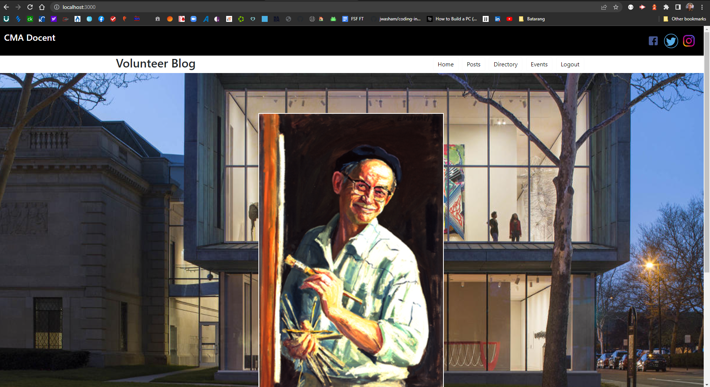

# Columbus Museum of Art Docent Website
---
  
  ## Description 
This Application is designed to allow the docents of the CMA to use a clean and intuitive user interface that will allow docents to use one resource for all informational needs. 
---  
  
  ## Table of Contents
  * [License](#license)
  * [Usage](#usage)
  * [Repo](#repo)
  * [URL](#url)
  * [Questions](#questions)
  
 
  ## License 
  This project is license under MIT.

 
  ## Usage
  This app was exclusively designed for the docent corps at the Columbus Museum of Art.

  
  ## Repo
  The Github repo is https://github.com/Maxthemilian52/batarang

  ##  URL
  [Deployed App Link](https://)

 

  ## Questions
  If you have any questions about this projects, please contact any contributors

  * Bill Hardgrove - Server   Github-  [WmHHardgrove](https://github.com/WmHHardgrove)
  * Marcus Martinez - Client   GitHub-  [marcu0912](https://github.com/marcu0912)
  * David Deitz - Client    GitHub-  [IonicCraze](https://github.com/IonicCraze)
  * Max Shaw - Server   Github-   [Maxthemilian52](https://github.com/Maxthemilian52)